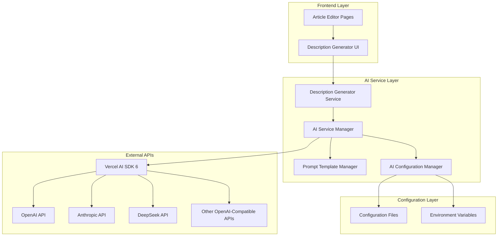

# Design Document: AI-Enhanced Article Editing

## Overview

This feature integrates AI-powered intelligent description generation into the existing article editing interface to enhance content creation efficiency. The system provides automatic article summary generation from content using configurable OpenAI-compatible language models through Vercel AI SDK 6. The implementation maintains existing UI patterns while adding seamless AI capabilities that can be configured to work with different LLM providers without code changes.

## Architecture

The AI enhancement follows a modular architecture that extends the current article editing system without disrupting existing functionality:



## Components and Interfaces

### AI Service Manager

Central service that coordinates AI operations and manages configurable provider connections.

**Interface:**

```typescript
interface AIServiceManager {
  generateDescription(content: string, prompt?: string): Promise<string>;
  validateConfiguration(): Promise<boolean>;
  getAvailableProviders(): Promise<ProviderInfo[]>;
  switchProvider(providerId: string): Promise<void>;
}

interface ProviderInfo {
  baseUrl?: string;
  model: string;
  isConfigured: boolean;
}
```

### Description Generator Service

Handles intelligent description generation from article content with configurable prompts.

**Interface:**

```typescript
interface DescriptionGeneratorService {
  generateDescription(content: string, customPrompt?: string): Promise<DescriptionResult>;
  validatePrompt(prompt: string): ValidationResult;
  getDefaultPrompt(): string;
  setDefaultPrompt(prompt: string): void;
}

interface DescriptionResult {
  description: string;
  wordCount: number;
  truncated: boolean;
  provider: string;
  model: string;
}

interface ValidationResult {
  isValid: boolean;
  error?: string;
  suggestions?: string[];
}
```

### AI Configuration Manager

Manages provider configurations and settings persistence.

**Interface:**

```typescript
interface AIConfigurationManager {
  loadConfiguration(): Promise<AIConfiguration>;
  saveConfiguration(config: AIConfiguration): Promise<void>;
  validateProvider(config: ProviderConfig): Promise<boolean>;
  getActiveProvider(): ProviderConfig;
  setActiveProvider(providerId: string): Promise<void>;
}

interface ProviderConfig {
  id: string;
  name: string;
  apiKey: string;
  baseUrl: string;
  model: string;
  enabled: boolean;
}
```

## Data Models

### AI Configuration

```typescript
interface AIConfiguration {
  providers: {
    [key: string]: ProviderConfig;
  };
  activeProvider: string;
  prompts: {
    defaultDescriptionPrompt: string;
    customPrompts: { [key: string]: string };
  };
  limits: {
    maxDescriptionLength: number;
    maxPromptLength: number;
    requestTimeout: number;
  };
}

interface ProviderConfig {
  id: string;
  name: string;
  apiKey: string;
  baseUrl: string;
  model: string;
  enabled: boolean;
  headers?: { [key: string]: string };
}
```

### Generation State

```typescript
interface GenerationState {
  isGenerating: boolean;
  progress?: number;
  error?: string;
  canRetry: boolean;
  abortController?: AbortController;
  currentProvider?: string;
}
```

## Correctness Properties

_A property is a characteristic or behavior that should hold true across all valid executions of a system-essentially, a formal statement about what the system should do. Properties serve as the bridge between human-readable specifications and machine-verifiable correctness guarantees._

### Property Reflection

After analyzing the prework, I identified several properties that can be consolidated:

- Properties 1.2, 1.3, 2.6 all test configuration management and can be combined into a comprehensive configuration property
- Properties 2.2, 2.3 both test provider switching and can be combined
- Properties 3.2, 3.3 both test UI state updates and can be combined
- Properties 4.1, 4.2, 4.5 all relate to error handling and can be combined

### Core Properties

**Property 1: Description Generation Consistency**
_For any_ article content with sufficient text, generating a description should produce a non-empty summary that respects the configured length limits
**Validates: Requirements 1.1, 1.4**

**Property 2: Configuration Management**
_For any_ valid configuration change (prompt templates, provider settings), the system should apply the new settings immediately without requiring restart
**Validates: Requirements 1.2, 1.3, 2.6**

**Property 3: Provider Integration**
_For any_ configured OpenAI-compatible provider, the system should successfully route API calls to the correct endpoint and use the specified model
**Validates: Requirements 2.2, 2.3**

**Property 4: Input Validation**
_For any_ invalid input (empty content, invalid prompts, missing API keys), the system should provide appropriate error messages without exposing sensitive information
**Validates: Requirements 1.5, 2.4, 4.4**

**Property 5: UI State Synchronization**
_For any_ AI operation state change (start, progress, complete, error), the user interface should reflect the current state accurately with appropriate visual feedback
**Validates: Requirements 3.2, 3.3**

**Property 6: Configuration Loading**
_For any_ system initialization, the configuration manager should successfully load provider settings from configuration files or provide clear error messages
**Validates: Requirements 2.1**

**Property 7: Error Handling and Graceful Degradation**
_For any_ service error (network issues, rate limits, service unavailability), the system should handle errors gracefully and maintain functionality where possible
**Validates: Requirements 4.1, 4.2, 4.3, 4.5**

## Error Handling

### Error Categories and Responses

**Network Errors:**

- Connection timeouts: Retry with exponential backoff
- DNS resolution failures: Display connectivity error message
- Rate limiting: Show quota information and retry timing

**Authentication Errors:**

- Invalid API keys: Clear error without exposing key values
- Expired tokens: Automatic refresh if supported
- Insufficient permissions: Guide user to check API key settings

**Content Validation Errors:**

- Empty article content: Prompt user to add content before generation
- Prompt too long: Automatic truncation with user notification
- Invalid characters: Sanitization with user confirmation

**AI Service Errors:**

- Model unavailable: Fallback to alternative models if configured
- Generation failures: Retry options with different parameters
- Quota exceeded: Clear usage information and upgrade suggestions

### Graceful Degradation

When AI services are unavailable:

1. Hide AI generation buttons with explanatory tooltip
2. Preserve existing manual input functionality
3. Cache failed requests for retry when service recovers
4. Provide clear status indicators for service availability

## Testing Strategy

### Dual Testing Approach

The testing strategy employs both unit tests and property-based tests to ensure comprehensive coverage:

**Unit Tests:**

- Specific examples of successful generation workflows
- Edge cases like empty content, network failures, invalid API keys
- UI component behavior and state management
- Integration points between components

**Property-Based Tests:**

- Universal properties across all inputs using fast-check library
- Minimum 100 iterations per property test
- Each test tagged with: **Feature: ai-enhanced-article-editing, Property {number}: {property_text}**
- Comprehensive input coverage through randomization

**Property Test Configuration:**

- Library: fast-check (TypeScript property-based testing)
- Iterations: 100 minimum per property
- Timeout: 30 seconds per property test
- Generators: Custom generators for article content, prompts, and API responses

**Testing Focus Areas:**

- **Description Generation:** Content parsing, length validation, prompt handling
- **Provider Configuration:** API key handling, endpoint switching, model selection
- **UI Integration:** State management, loading indicators, error display
- **Configuration Management:** Hot reloading, validation, persistence
- **Error Scenarios:** Network failures, invalid inputs, service unavailability

The combination ensures that unit tests catch concrete bugs while property tests verify general correctness across the input space.
