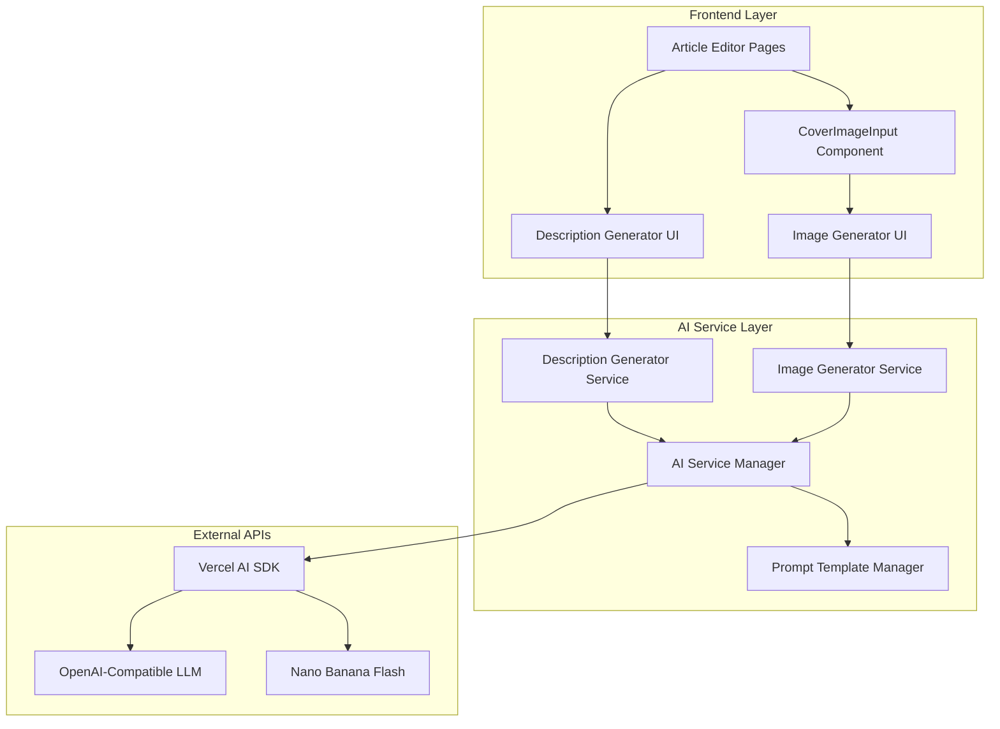

# Design Document: AI-Enhanced Article Editing

## Overview

This feature integrates AI capabilities into the existing article editing interface to enhance content creation efficiency. The system provides two main AI-powered features: intelligent description generation from article content and AI-generated cover images using Google's Nano Banana Flash model. The implementation leverages the Vercel AI SDK for unified model integration while maintaining the existing UI patterns and user experience.

## Architecture

The AI enhancement follows a modular architecture that extends the current article editing system without disrupting existing functionality:



## Components and Interfaces

### AI Service Manager

Central service that coordinates AI operations and manages API configurations.

**Interface:**

```typescript
interface AIServiceManager {
  generateDescription(content: string, prompt?: string): Promise<string>;
  generateImage(prompt: string, options?: ImageGenerationOptions): Promise<string>;
  validateApiKeys(): Promise<boolean>;
  getAvailableModels(): Promise<ModelInfo[]>;
}

interface ImageGenerationOptions {
  aspectRatio?: string;
  size?: string;
  seed?: number;
}

interface ModelInfo {
  id: string;
  name: string;
  type: 'text' | 'image';
  provider: string;
}
```

### Description Generator Service

Handles intelligent description generation from article content.

**Interface:**

```typescript
interface DescriptionGeneratorService {
  generateDescription(content: string, customPrompt?: string): Promise<DescriptionResult>;
  validatePrompt(prompt: string): ValidationResult;
  getDefaultPrompt(): string;
  setDefaultPrompt(prompt: string): void;
}

interface DescriptionResult {
  description: string;
  wordCount: number;
  truncated: boolean;
}

interface ValidationResult {
  isValid: boolean;
  error?: string;
  suggestions?: string[];
}
```

### Image Generator Service

Manages AI-powered cover image generation using Nano Banana Flash.

**Interface:**

```typescript
interface ImageGeneratorService {
  generateImage(prompt: string, options?: ImageGenerationOptions): Promise<ImageResult>;
  validateImagePrompt(prompt: string): ValidationResult;
  getDefaultImagePrompt(): string;
  setDefaultImagePrompt(prompt: string): void;
}

interface ImageResult {
  imageUrl: string;
  base64Data?: string;
  metadata: {
    model: string;
    prompt: string;
    aspectRatio: string;
    generationTime: number;
  };
}
```

### Enhanced CoverImageInput Component

Extended version of the existing component with AI generation capability.

**New Props:**

```typescript
interface CoverImageInputProps {
  // Existing props...
  value: string;
  onChange: (url: string) => void;
  disabled?: boolean;
  className?: string;

  // New AI-related props
  enableAIGeneration?: boolean;
  articleContent?: string;
  onAIGenerationStart?: () => void;
  onAIGenerationComplete?: (result: ImageResult) => void;
  onAIGenerationError?: (error: string) => void;
}
```

## Data Models

### AI Configuration

```typescript
interface AIConfiguration {
  textModel: {
    provider: string;
    modelId: string;
    apiKey: string;
    baseUrl?: string;
  };
  imageModel: {
    provider: 'google';
    modelId: 'gemini-2.5-flash-image';
    apiKey: string;
  };
  prompts: {
    defaultDescriptionPrompt: string;
    defaultImagePrompt: string;
  };
  limits: {
    maxDescriptionLength: number;
    maxPromptLength: number;
    requestTimeout: number;
  };
}
```

### Generation State

```typescript
interface GenerationState {
  isGenerating: boolean;
  progress?: number;
  error?: string;
  canRetry: boolean;
  abortController?: AbortController;
}
```

## Correctness Properties

_A property is a characteristic or behavior that should hold true across all valid executions of a system-essentially, a formal statement about what the system should do. Properties serve as the bridge between human-readable specifications and machine-verifiable correctness guarantees._

### Property Reflection

After analyzing the prework, I identified several properties that can be consolidated:

- Properties 1.2, 1.3, 2.4 all test prompt template usage and can be combined into a comprehensive prompt management property
- Properties 2.2, 3.3 both test model configuration and can be combined
- Properties 4.2, 4.3 both test UI state updates and can be combined
- Properties 1.4 and 5.3 both relate to content quality validation

### Core Properties

**Property 1: Description Generation Consistency**
_For any_ article content with sufficient text, generating a description should produce a non-empty summary that respects the configured length limits
**Validates: Requirements 1.1, 1.4**

**Property 2: Prompt Template Management**
_For any_ valid prompt template change, subsequent AI operations should use the updated prompt immediately without requiring system restart
**Validates: Requirements 1.2, 1.3, 2.4**

**Property 3: Model Configuration Integrity**
_For any_ AI operation, the system should use the correctly configured model (OpenAI-compatible for text, Nano Banana Flash for images) as specified in the environment configuration
**Validates: Requirements 2.2, 3.2, 3.3**

**Property 4: Image Generation Completeness**
_For any_ successful image generation request, the result should include a valid image URL and complete metadata including model, prompt, and generation parameters
**Validates: Requirements 2.3, 2.5**

**Property 5: UI State Synchronization**
_For any_ AI operation state change (start, progress, complete, error), the user interface should reflect the current state accurately with appropriate visual feedback
**Validates: Requirements 4.2, 4.3**

**Property 6: API Key Validation**
_For any_ system initialization, the AI SDK should successfully authenticate with configured API keys or provide clear error messages without exposing sensitive information
**Validates: Requirements 3.1**

**Property 7: Content Quality Assurance**
_For any_ generated content that doesn't meet quality standards, the system should provide regeneration options with different parameters
**Validates: Requirements 5.3**

## Error Handling

### Error Categories and Responses

**Network Errors:**

- Connection timeouts: Retry with exponential backoff
- DNS resolution failures: Display connectivity error message
- Rate limiting: Show quota information and retry timing

**Authentication Errors:**

- Invalid API keys: Clear error without exposing key values
- Expired tokens: Automatic refresh if supported
- Insufficient permissions: Guide user to check API key settings

**Content Validation Errors:**

- Empty article content: Prompt user to add content before generation
- Prompt too long: Automatic truncation with user notification
- Invalid characters: Sanitization with user confirmation

**AI Service Errors:**

- Model unavailable: Fallback to alternative models if configured
- Generation failures: Retry options with different parameters
- Quota exceeded: Clear usage information and upgrade suggestions

### Graceful Degradation

When AI services are unavailable:

1. Hide AI generation buttons with explanatory tooltip
2. Preserve existing manual input functionality
3. Cache failed requests for retry when service recovers
4. Provide clear status indicators for service availability

## Testing Strategy

### Dual Testing Approach

The testing strategy employs both unit tests and property-based tests to ensure comprehensive coverage:

**Unit Tests:**

- Specific examples of successful generation workflows
- Edge cases like empty content, network failures, invalid API keys
- UI component behavior and state management
- Integration points between components

**Property-Based Tests:**

- Universal properties across all inputs using fast-check library
- Minimum 100 iterations per property test
- Each test tagged with: **Feature: ai-enhanced-article-editing, Property {number}: {property_text}**
- Comprehensive input coverage through randomization

**Property Test Configuration:**

- Library: fast-check (TypeScript property-based testing)
- Iterations: 100 minimum per property
- Timeout: 30 seconds per property test
- Generators: Custom generators for article content, prompts, and API responses

**Testing Focus Areas:**

- **Description Generation:** Content parsing, length validation, prompt handling
- **Image Generation:** Model integration, result processing, error handling
- **UI Integration:** State management, loading indicators, error display
- **Configuration Management:** API key handling, model switching, prompt updates
- **Error Scenarios:** Network failures, invalid inputs, service unavailability

The combination ensures that unit tests catch concrete bugs while property tests verify general correctness across the input space.
