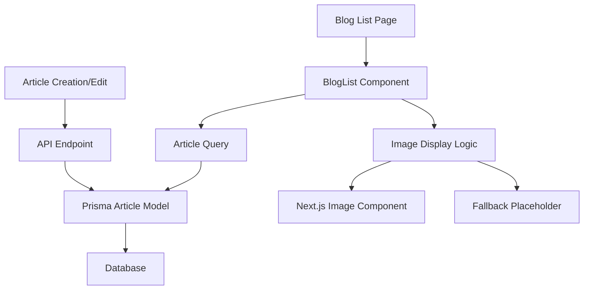

# Design Document: Article Cover Images

## Overview

This design implements cover image support for the blog system, enabling articles to display featured images in the blog list and potentially other views. The solution extends the existing Article model with a cover image field and enhances the BlogList component to display these images with proper fallback handling.

The design prioritizes backward compatibility, ensuring existing articles continue to work seamlessly while new articles can leverage cover images for enhanced visual appeal.

## Architecture

The cover image feature integrates into the existing Next.js blog architecture through three main layers:

1. **Data Layer**: Extends the Prisma Article model with an optional coverPic field (mapped to cover_pic in database)
2. **API Layer**: Updates article creation/editing endpoints to handle cover image URLs
3. **Presentation Layer**: Enhances the BlogList component to display cover images with fallback support



## Components and Interfaces

### Database Schema Changes

**Article Model Extension**:

```typescript
model Article {
  id          String   @id @default(cuid())
  title       String
  content     String
  slug        String   @unique
  published   Boolean  @default(false)
  createdAt   DateTime @default(now())
  updatedAt   DateTime @updatedAt
  coverPic    String?  @map("cover_pic") // Maps to snake_case in database
  // ... existing fields
}
```

**Design Rationale**: Using an optional string field allows for flexible image storage (URLs to external services, local paths, or CDN links) while maintaining backward compatibility. The field uses camelCase in TypeScript (`coverPic`) but maps to snake_case in the database (`cover_pic`) following conventional naming practices.

### BlogList Component Enhancement

**Enhanced BlogList Interface**:

```typescript
interface ArticleWithCover {
  id: string;
  title: string;
  slug: string;
  createdAt: Date;
  coverPic: string | null; // camelCase in TypeScript
  // ... other article fields
}

interface BlogListProps {
  articles: ArticleWithCover[];
  currentPage: number;
  totalPages: number;
}
```

**Image Display Logic**:

- Primary: Display coverPic if available and valid
- Fallback: Show placeholder image for articles without coverPic
- Error Handling: Display fallback if coverPic URL fails to load

### API Endpoint Updates

**Article Creation/Update Endpoints**:

```typescript
// POST/PUT /admin/api/articles
interface ArticleRequest {
  title: string;
  content: string;
  published: boolean;
  coverPic?: string; // Optional cover image URL (camelCase)
}
```

## Data Models

### Cover Image Validation

**URL Validation Rules**:

- Basic URL format validation (http/https protocols)
- Maximum length constraint (2048 characters)
- Optional MIME type validation for common image formats

**Storage Strategy**:

- Store URLs as strings in the database
- Support for external image services (Cloudinary, AWS S3, etc.)
- Support for local public directory images
- No binary image storage in database

## Correctness Properties

_A property is a characteristic or behavior that should hold true across all valid executions of a system-essentially, a formal statement about what the system should do. Properties serve as the bridge between human-readable specifications and machine-verifiable correctness guarantees._

<function_calls>
<invoke name="prework">
<parameter name="featureName">article-cover-images

## Correctness Properties

_A property is a characteristic or behavior that should hold true across all valid executions of a system-essentially, a formal statement about what the system should do. Properties serve as the bridge between human-readable specifications and machine-verifiable correctness guarantees._

### Property Reflection

After analyzing the acceptance criteria, several properties can be consolidated to eliminate redundancy:

- Properties 2.1 and 2.2 both test image display behavior and can be combined into a comprehensive image rendering property
- Properties 2.3 and 3.3 both test fallback behavior for articles without cover images and can be unified
- Properties 4.1 and 4.3 both test error handling and can be combined into a comprehensive error handling property

### Core Properties

**Property 1: Article creation accepts optional cover images**
_For any_ article data with or without a coverPic field, the system should successfully create or update the article
**Validates: Requirements 1.2**

**Property 2: URL validation enforces constraints**
_For any_ string input as coverPic, the system should accept valid URLs and reject invalid ones based on format and length constraints
**Validates: Requirements 1.3, 4.2**

**Property 3: Null coverPic handling**
_For any_ article with null coverPic, the system should handle database operations and display logic without errors
**Validates: Requirements 1.4**

**Property 4: Cover image display and fallback**
_For any_ article with a valid coverPic, the BlogList should display the image; for any article with null or invalid coverPic, the BlogList should display a placeholder
**Validates: Requirements 2.1, 2.2, 2.3, 3.3**

**Property 5: Migration preserves existing articles**
_For any_ article existing before the schema migration, the article should remain accessible with null coverPic after migration
**Validates: Requirements 3.2**

**Property 6: Error handling for invalid URLs**
_For any_ invalid image URL or loading failure, the system should display fallback content without crashing
**Validates: Requirements 4.1, 4.3**

## Error Handling

### Database Level

- **Schema Migration**: Use Prisma migrations to safely add the coverPic field (mapped to cover_pic in database) with proper rollback support
- **Constraint Violations**: Handle URL length violations gracefully with descriptive error messages
- **Null Handling**: Ensure all database queries properly handle null coverPic values

### API Level

- **Validation Errors**: Return 400 Bad Request for invalid coverPic URLs with specific error messages
- **Missing Fields**: Accept requests with or without coverPic field (optional parameter)
- **Database Errors**: Return 500 Internal Server Error for database connection issues

### UI Level

- **Image Loading Failures**: Display placeholder image when coverPic URL fails to load
- **Invalid URLs**: Show fallback content for malformed URLs
- **Network Issues**: Graceful degradation when images can't be fetched
- **Responsive Fallbacks**: Ensure placeholder images maintain proper layout

## Testing Strategy

### Dual Testing Approach

The testing strategy combines unit tests for specific scenarios with property-based tests for comprehensive coverage:

**Unit Tests**:

- Test specific examples of valid and invalid URLs
- Test database migration scenarios
- Test React component rendering with and without cover images
- Test API endpoint responses for various input combinations

**Property-Based Tests**:

- Generate random article data to test creation/update operations (Property 1)
- Generate various URL formats to test validation logic (Property 2)
- Test null handling across all database and UI operations (Property 3)
- Test image display logic across all article states (Property 4)
- Test migration behavior across existing article datasets (Property 5)
- Generate invalid URLs and loading failures to test error handling (Property 6)

### Testing Configuration

- **Framework**: Jest for unit tests, fast-check for property-based testing
- **Minimum Iterations**: 100 iterations per property test
- **Test Tags**: Each property test tagged with format: **Feature: article-cover-images, Property {number}: {property_text}**
- **Coverage**: Both unit and property tests are required for comprehensive validation

### Integration Testing

- Test complete flow from article creation with coverPic to display in BlogList
- Test database migration with real article data
- Test image loading and fallback behavior in browser environment
- Test responsive behavior across different screen sizes
