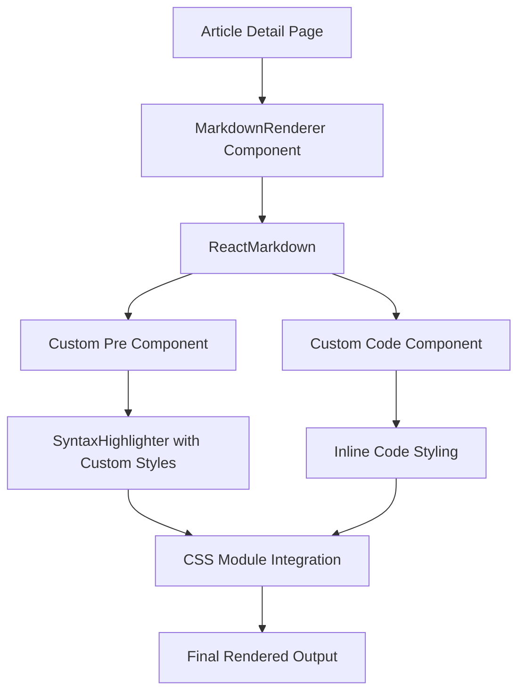

# Design Document: Code Block Styling Fix

## Overview

This design addresses the code block styling issues in the blog article detail pages. The problem stems from conflicts between the CSS module styles and the react-syntax-highlighter component's default styles, resulting in inconsistent or missing styling for code blocks.

The solution involves refactoring the MarkdownRenderer component to properly integrate CSS module styles with react-syntax-highlighter, ensuring consistent theming and typography across all code blocks.

## Architecture

### Current Architecture Issues

The current implementation has several problems:

1. CSS module styles in `markdown.module.css` are not being properly applied to syntax-highlighted code blocks
2. The `react-syntax-highlighter` component uses its own styling system that may override CSS module styles
3. Inline code and code block styling are inconsistent
4. CSS variables defined in `globals.css` are not being utilized effectively

### Proposed Architecture



## Components and Interfaces

### Enhanced MarkdownRenderer Component

The `MarkdownRenderer` component will be updated to:

- Properly integrate CSS module styles with syntax highlighting
- Use CSS variables for consistent theming
- Handle both inline code and code blocks appropriately
- Ensure responsive design and cross-browser compatibility

### Custom Code Block Component

A new `CodeBlock` component will be created to:

- Wrap the SyntaxHighlighter with proper CSS module integration
- Apply custom styling that respects the design system
- Handle language detection and fallbacks
- Provide consistent spacing and layout

### CSS Module Updates

The `markdown.module.css` will be updated to:

- Define styles that work with react-syntax-highlighter
- Use CSS custom properties for theming
- Ensure proper specificity to override default styles
- Maintain responsive design principles

## Data Models

### Code Block Configuration

```typescript
interface CodeBlockConfig {
  language: string;
  theme: 'vscDarkPlus' | 'github';
  customStyle: React.CSSProperties;
  showLineNumbers?: boolean;
  wrapLines?: boolean;
}

interface InlineCodeConfig {
  backgroundColor: string;
  textColor: string;
  borderRadius: string;
  padding: string;
  fontSize: string;
}
```

### Component Props

```typescript
interface MarkdownRendererProps {
  content: string;
  className?: string;
  codeBlockConfig?: Partial<CodeBlockConfig>;
}

interface CodeBlockProps {
  children: string;
  className?: string;
  language?: string;
}
```

## Correctness Properties

_A property is a characteristic or behavior that should hold true across all valid executions of a system-essentially, a formal statement about what the system should do. Properties serve as the bridge between human-readable specifications and machine-verifiable correctness guarantees._

<function_calls>
<invoke name="prework">
<parameter name="featureName">code-block-styling-fix

### Property Reflection

After reviewing the prework analysis, I identified several properties that can be consolidated:

- Properties 1.1, 1.2, and 1.3 all relate to consistent visual styling and can be combined into a comprehensive styling consistency property
- Properties 2.1, 2.2, and 2.3 all relate to typography and can be combined into a typography consistency property
- Properties 3.1, 3.2, and 3.3 all relate to spacing and can be combined into a spacing consistency property
- Properties 4.1, 4.2, 4.4, and 4.5 all relate to CSS integration and can be combined into a CSS integration property

### Correctness Properties

Property 1: Code block visual consistency
_For any_ article containing code blocks, all code blocks should have consistent dark theme styling, VS Code Dark Plus syntax highlighting, and proper visual effects (border radius, padding, shadows)
**Validates: Requirements 1.1, 1.2, 1.3**

Property 2: Inline code differentiation  
_For any_ article containing inline code, the inline code elements should have distinct background and text colors that differentiate them from regular text
**Validates: Requirements 1.4**

Property 3: Language-specific highlighting
_For any_ code block with a specified programming language, the syntax highlighting should be appropriate for that language and different from other languages
**Validates: Requirements 1.5**

Property 4: Typography consistency
_For any_ code element (block or inline), the typography should use the defined monospace font stack, appropriate sizing, and consistent character spacing
**Validates: Requirements 2.1, 2.2, 2.3**

Property 5: Inline code sizing
_For any_ article containing both inline code and regular text, the inline code font size should be smaller than the regular text font size
**Validates: Requirements 2.4**

Property 6: Overflow handling
_For any_ code block containing long lines, horizontal scrolling should be provided without breaking the page layout
**Validates: Requirements 2.5**

Property 7: Spacing consistency
_For any_ article containing code blocks, the spacing (margins and padding) should be consistent across all code blocks and maintain proper layout
**Validates: Requirements 3.1, 3.2, 3.3**

Property 8: Responsive design preservation
_For any_ code block displayed on mobile viewport sizes, readability and proper spacing should be maintained
**Validates: Requirements 3.4**

Property 9: Layout preservation with overflow
_For any_ code block with overflow content, the scrolling should not affect the overall page layout
**Validates: Requirements 3.5**

Property 10: CSS module integration
_For any_ code element rendered by the Markdown_Renderer, CSS module classes should be properly applied and take precedence over conflicting styles
**Validates: Requirements 4.1, 4.2, 4.4, 4.5**

Property 11: CSS variable consistency
_For any_ code styling property, the values should match the corresponding CSS variables defined in the design system
**Validates: Requirements 4.3**

Property 12: Font fallback behavior
_For any_ system with different available fonts, the monospace font stack should fallback gracefully to available fonts
**Validates: Requirements 5.5**

## Error Handling

### Missing Language Detection

- When a code block lacks language specification, default to plain text highlighting
- Provide fallback styling that maintains readability

### CSS Loading Failures

- Implement fallback styles that work without CSS modules
- Ensure basic readability even if custom styles fail to load

### Syntax Highlighter Failures

- Gracefully degrade to unstyled code blocks if syntax highlighting fails
- Maintain monospace font and basic styling as minimum viable presentation

### Mobile Rendering Issues

- Implement responsive breakpoints for code block styling
- Ensure horizontal scrolling works on touch devices
- Provide fallback for devices with limited CSS support

## Testing Strategy

### Unit Testing

- Test individual component rendering with various code block configurations
- Verify CSS class application and style computation
- Test edge cases like empty code blocks and unsupported languages
- Validate responsive behavior at different viewport sizes

### Property-Based Testing

- Use a property-based testing library (such as fast-check for TypeScript)
- Generate random markdown content with various code block configurations
- Verify that all correctness properties hold across generated inputs
- Test with minimum 100 iterations per property to ensure comprehensive coverage
- Each property test should be tagged with: **Feature: code-block-styling-fix, Property {number}: {property_text}**

### Integration Testing

- Test the complete markdown rendering pipeline from content to styled output
- Verify interaction between CSS modules and syntax highlighter
- Test with real article content from the database
- Validate cross-browser compatibility through automated testing

### Visual Regression Testing

- Capture screenshots of code blocks before and after changes
- Compare visual output across different browsers and devices
- Ensure consistent appearance across various code languages and themes

The testing approach combines unit tests for specific functionality with property-based tests for comprehensive coverage of the universal properties that must hold for all code blocks.
