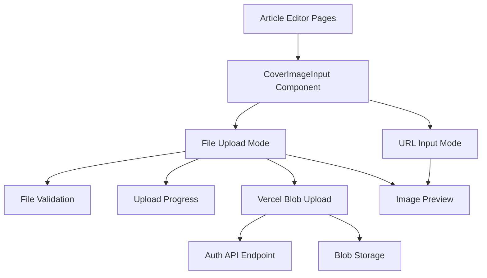

# Design Document: Cover Image Upload

## Overview

This design enhances the existing article creation and editing interface by adding direct file upload capabilities for cover images. The solution integrates with the existing Vercel Blob infrastructure and maintains backward compatibility with URL-based cover images.

The implementation follows a client-side direct upload pattern using the existing `/admin/api/upload/auth` endpoint, ensuring secure and efficient image handling without server-side file processing.

## Architecture

### Component Architecture



### Data Flow

1. **User Interaction**: User selects between URL input or file upload
2. **File Selection**: User selects/drops image file
3. **Client Validation**: File type and size validation
4. **Authentication**: Request upload token from auth API
5. **Direct Upload**: Client uploads directly to Vercel Blob
6. **URL Storage**: Blob URL stored in form state and database

## Components and Interfaces

### CoverImageInput Component

A new reusable component that encapsulates both URL input and file upload functionality:

```typescript
interface CoverImageInputProps {
  value: string;
  onChange: (url: string) => void;
  disabled?: boolean;
  className?: string;
}

interface UploadState {
  isUploading: boolean;
  progress: number;
  error: string | null;
}
```

### Upload Service

A utility service for handling Vercel Blob uploads:

```typescript
interface UploadOptions {
  file: File;
  onProgress?: (progress: number) => void;
  onError?: (error: Error) => void;
}

interface UploadResult {
  url: string;
  filename: string;
}
```

### File Validation

```typescript
interface ValidationRules {
  maxSize: number; // 5MB
  allowedTypes: string[]; // ['image/jpeg', 'image/png', 'image/webp', 'image/gif']
}

interface ValidationResult {
  isValid: boolean;
  error?: string;
}
```

## Data Models

No database schema changes are required. The existing `coverPic` field in the Article model will store either:

- External URLs (existing functionality)
- Vercel Blob URLs (new functionality)

The field remains a nullable string with the same constraints.

## Correctness Properties

_A property is a characteristic or behavior that should hold true across all valid executions of a system-essentially, a formal statement about what the system should do. Properties serve as the bridge between human-readable specifications and machine-verifiable correctness guarantees._

### Property Reflection

After analyzing the acceptance criteria, several properties can be consolidated to eliminate redundancy:

- File validation properties (1.3, 1.4, 5.1) can be combined into comprehensive validation testing
- Upload success properties (1.5, 2.4) can be merged into upload completion verification
- Error handling properties (2.5, 5.2, 5.3, 5.4) can be consolidated into comprehensive error handling
- Data persistence properties (4.3, 4.4) can be combined into storage verification

### Core Properties

**Property 1: File validation rejects invalid inputs**
_For any_ file input, files that are not valid image types (jpg, jpeg, png, webp, gif) or exceed 5MB should be rejected with appropriate error messages
**Validates: Requirements 1.3, 1.4, 5.1**

**Property 2: Upload naming convention compliance**
_For any_ successful upload to Vercel Blob, the generated filename should follow the pattern `cover/{filename}+{16位base64随机值}.${ext}`
**Validates: Requirements 2.2**

**Property 3: Authentication requirement for uploads**
_For any_ upload request, the system should authenticate using the existing auth API before allowing upload to proceed
**Validates: Requirements 2.1**

**Property 4: Upload completion provides valid URL**
_For any_ successful image upload, the system should return a valid public URL and display an image preview
**Validates: Requirements 1.5, 2.4**

**Property 5: Upload state management**
_For any_ upload in progress, the UI should display progress indicators and disable upload controls to prevent duplicate uploads
**Validates: Requirements 3.2, 3.3**

**Property 6: Mode switching clears previous input**
_For any_ switch between URL input and file upload modes, the previous input value should be cleared
**Validates: Requirements 3.4**

**Property 7: URL validation and preview**
_For any_ valid image URL input, the system should validate the URL format and display an image preview
**Validates: Requirements 4.1, 4.2**

**Property 8: Data persistence consistency**
_For any_ article save operation, cover image URLs (whether from upload or direct input) should be correctly stored and retrievable from the database
**Validates: Requirements 4.3, 4.4, 4.5**

**Property 9: Comprehensive error handling**
_For any_ upload error (network, authentication, quota, etc.), the system should display descriptive error messages and maintain URL input as a fallback option
**Validates: Requirements 2.5, 5.2, 5.3, 5.4, 5.5**

**Property 10: Drag and drop functionality**
_For any_ image file dragged and dropped onto the upload area, the upload process should be initiated
**Validates: Requirements 3.1**

## Error Handling

### Client-Side Validation

- File type validation before upload attempt
- File size validation (5MB limit)
- URL format validation for direct input
- Real-time feedback for validation errors

### Upload Error Scenarios

- Network connectivity issues → Retry option
- Authentication failures → Clear error message
- Storage quota exceeded → Quota error message
- Invalid file format → Format specification error
- File too large → Size limit error

### Fallback Mechanisms

- URL input always available as fallback
- Graceful degradation when upload fails
- Preserve existing URL-based functionality
- Cancel upload capability

## Testing Strategy

### Dual Testing Approach

The testing strategy employs both unit tests and property-based tests to ensure comprehensive coverage:

**Unit Tests**: Focus on specific examples, edge cases, and integration points

- Component rendering with both input modes
- Specific error scenarios (network failure, auth failure)
- UI state transitions (loading, success, error states)
- Integration with existing article forms

**Property-Based Tests**: Verify universal properties across all inputs

- File validation across random file types and sizes
- Upload naming convention compliance
- Error handling consistency
- Data persistence verification

### Property-Based Testing Configuration

- **Framework**: fast-check (JavaScript property testing library)
- **Test Iterations**: Minimum 100 iterations per property test
- **Test Tagging**: Each property test tagged with format: **Feature: cover-image-upload, Property {number}: {property_text}**

### Test Coverage Areas

1. **File Upload Flow**

   - Valid image uploads with various formats
   - Invalid file rejection (wrong type, too large)
   - Upload progress and completion states

2. **URL Input Flow**

   - Valid URL validation and preview
   - Invalid URL handling
   - Backward compatibility with existing articles

3. **Error Scenarios**

   - Network failures during upload
   - Authentication errors
   - Storage quota exceeded
   - Malformed files

4. **User Experience**
   - Drag and drop functionality
   - Mode switching behavior
   - Progress indicators and loading states
   - Cancel upload operations

### Integration Testing

- Test integration with existing article creation/editing forms
- Verify database persistence for both URL and uploaded images
- Test compatibility with existing VditorEditor component
- Validate auth API integration
